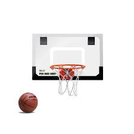

# Backboard-Project

# Project outline
For this project, we want to make a basketball backboard.
We hope to have either a homemade backboard or online backboard and a rim.
We will create code to have a counter that counts when a basket is made.
The backboard will have a display screen with the running number of baskets.
We will use an ultrasonic sensor for the backboard.
We will have a button on the device that will make the running counter reset to 0.

# Goals for the project
Goals for the project:
To make a durable and useful backboard.
To make something that other people can have fun with.
To write our own code.
To learn how to design something and use code at the same time.

This is a picture of what the backboard will look like

# psuedo code

"Start the running code

Read distance 
Delay 1 sec
If distance=>1 and <5 then counter ==1
If distance is <1 or >5 counter stays the same
Counter = display screen
If counter +1 then display screen +1
If button is pressed counter + display screen = 0"

# Picture of sketch in onshape

# Drawing on Paper

# Goal

Last week our goal was to make an LED turn on when the ultrasonic sensor read a distance less than 50mm. We achieved that goal. Code for this:
"// ---------------------------------------------------------------- //
// Arduino Ultrasoninc Sensor HC-SR04
// Re-writed by Arbi Abdul Jabbaar
// Using Arduino IDE 1.8.7
// Using HC-SR04 Module
// Tested on 17 September 2019
// ---------------------------------------------------------------- //
int led = 8;
int counter = 0;
#define echoPin 2 // attach pin D2 Arduino to pin Echo of HC-SR04
#define trigPin 3 //attach pin D3 Arduino to pin Trig of HC-SR04

// defines variables
long duration; // variable for the duration of sound wave travel
int distance; // variable for the distance measurement
int oldDistance;//variable for the distance from the last loop
void setup() {
  pinMode(trigPin, OUTPUT); // Sets the trigPin as an OUTPUT
  pinMode(echoPin, INPUT); // Sets the echoPin as an INPUT
  Serial.begin(9600); // // Serial Communication is starting with 9600 of baudrate speed
  Serial.println("Ultrasonic Sensor HC-SR04 Test"); // print some text in Serial Monitor
  Serial.println("with Arduino UNO R3");
  pinMode(led, OUTPUT);
  Serial.println(counter);
}
void loop() {
  delay(500);
  // Clears the trigPin condition
  digitalWrite(trigPin, LOW);
  delayMicroseconds(2);
  // Sets the trigPin HIGH (ACTIVE) for 10 microseconds
  digitalWrite(trigPin, HIGH);
  delay(10);
  digitalWrite(trigPin, LOW);
  // Reads the echoPin, returns the sound wave travel time in microseconds
  duration = pulseIn(echoPin, HIGH);
  // Calculating the distance
  distance = duration * 0.034 / 2; // Speed of sound wave divided by 2 (go and back)
  // Displays the distance on the Serial Monitor
  Serial.print("Distance: ");
  Serial.print(distance);
  Serial.println(" cm");
  Serial.println(counter);
  if (distance != 0 && distance < 100) {
    if (distance < 20 && oldDistance >= 20) {
      digitalWrite(led, HIGH);
      counter++;
    }
    if (distance > 20) {
      digitalWrite(led, LOW);

    }
  }
oldDistance = distance;
  
}"
I think that we are on track to finish the project as long as we keep working and keep taking steps in the right direction.
One major obstacle is that I am not very good at code so that is going a little slow. Other than that the project is going well and should be done soon.

3/30 Eng notebook
The project is going slowly but surely. We have got all of our parts and should hopefully finish on the first day back from spring break. THe only obstacles are zoom and now I just have to figuire out how to code/attach the sensor. Aidan-When I retern to F2F school, I will code the counter and then start testing the hoop in the lab. 

